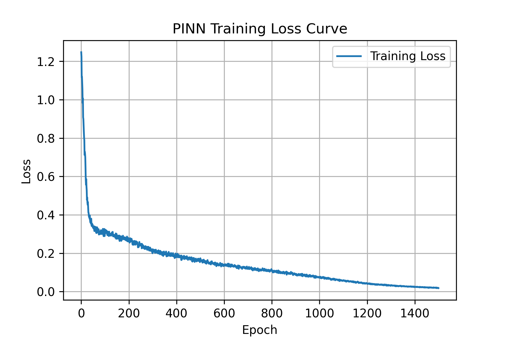
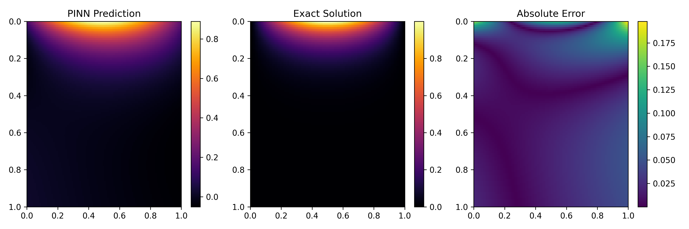

# HeatPINN - Physics-Informed Heat Equation Solver

HeatPINN is a minimal yet complete implementation of a Physics-Informed Neural Network (PINN) that learns the solution to the one-dimensional heat equation directly from the governing physics, boundary conditions, and initial condition, with no simulation data required. The project demonstrates how to use automatic differentiation in PyTorch to enforce partial differential equations (PDEs) while training a neural network that stays consistent with the underlying physics.

## Problem Setup

We solve the dimensionless heat equation on the unit space-time domain:

\\[
u_t = u_{xx}, \qquad x \in [0,1], \; t \in [0,1]
\\]

with:

- Initial condition: \\( u(x, 0) = \sin(\pi x) \\)
- Boundary conditions: \\( u(0, t) = u(1, t) = 0 \\)

An analytical solution exists,
\\( u(x,t) = e^{-\pi^2 t} \sin(\pi x) \\),
which we use for evaluation.

## Key Features

- **Lightweight PINN architecture** - configurable fully connected network defined in `src/pinn.py`.
- **Physics supervision** - PDE residual, initial, and boundary losses enforced simultaneously (see `src/train.py`).
- **Automated diagnostics** - training loss curves and heatmap comparisons saved to `outputs/plots`.
- **Deterministic evaluation** - exact solution sampler in `src/evaluate.py` for quantitative and qualitative assessments.
- **Explorable notebook** - `notebooks/HeatEquation_PINN_Demo.ipynb` walks through the same workflow interactively.

## Repository Structure

```
HeatPINN-Physics-Informed-Heat-Equation-Solver
|-- Dockerfile
|-- LICENSE
|-- README.md                # <- you are here
|-- requirements.txt
|-- notebooks/
|   `-- HeatEquation_PINN_Demo.ipynb
|-- outputs/
|   |-- plots/               # training/evaluation figures
|   `-- saved_models/        # checkpoints written by train.py
`-- src/
    |-- dataset.py           # sampling utilities for PDE/IC/BC points
    |-- evaluate.py          # evaluation + visualization script
    |-- main.py              # convenience entry point (train -> eval)
    |-- pinn.py              # neural network definition
    |-- train.py             # training loop for the PINN
    `-- utils.py             # autograd helpers (du/dt, d2u/dx2)
```

## Getting Started

### 1. Install dependencies

```bash
python -m venv .venv
source .venv/bin/activate           # On Windows: .venv\Scripts\activate
pip install -r requirements.txt
```

PyTorch CPU wheels are sufficient for this project.

### 2. Run training and evaluation

`src/main.py` trains the PINN and immediately runs inference using the saved checkpoint.

```bash
python src/main.py
```

During training you will see periodic logs with the PDE, initial-condition, and boundary-condition losses. The trained weights are written to `outputs/saved_models/model.pth`, the loss curve to `outputs/plots/training_loss.png`, and evaluation heatmaps to `outputs/plots/evaluation_heatmaps.png`.

### 3. (Optional) Run steps separately

```bash
# Train only
python src/train.py

# Evaluate an existing checkpoint
python src/evaluate.py
```

Make sure a checkpoint exists at `outputs/saved_models/model.pth` before evaluating.

## Configuration & Customization

| Component | Location | Notes |
|-----------|----------|-------|
| Network architecture | `src/pinn.py` | Edit the `layers` list to change depth/width or activation functions. |
| Training hyperparameters | `src/train.py` | Adjust epochs, learning rate, collocation counts (`n_sp`, `n_icp`, `n_bcp`), and loss weights (`alpha_*`). |
| PDE / IC / BC sampling | `src/dataset.py` | Replace the sampling routines to target new domains or boundary conditions. |
| PDE residual definition | `src/train.py` (`pde_residual`) | Swap in a different PDE or coefficients by editing the autograd expressions. |
| Exact solution (for eval) | `src/evaluate.py` | Provide a new analytical solution or numerical ground truth. |


## Outputs

- `outputs/saved_models/model.pth` - serialized PyTorch checkpoint.
- `outputs/plots/training_loss.png` - loss curve over epochs.
- `outputs/plots/evaluation_heatmaps.png` - side-by-side predicted solution, analytical solution, and absolute error.

## Sample Visualizations





## Notebook

If you prefer exploring the model interactively, open `notebooks/HeatEquation_PINN_Demo.ipynb` in Jupyter or VS Code. The notebook mirrors the scripts, so once you understand one workflow you can switch between them easily.


